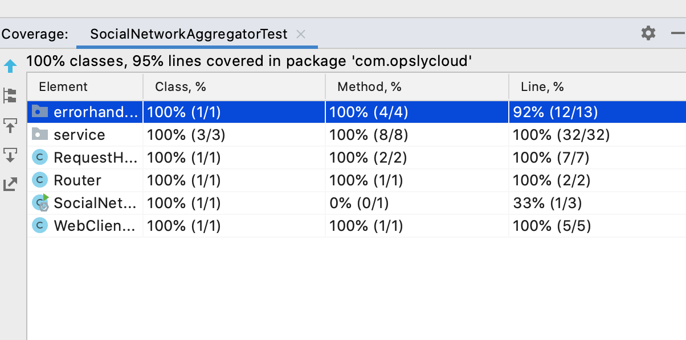

## Your mission:

A client needs to know what is happening on the social networks. All of them. Right now.

The three social networks the client is interested in are:

https://takehome.io/twitter

https://takehome.io/facebook

https://takehome.io/instagram

Because these social networks are so webscale, they don't always respond predictably. The delay in their response almost appears like someone waited for a random integer of seconds before responding!

Also, sometimes they will respond with an error. This error will not be valid JSON. Life's hard sometimes.

The client needs to be able to run your thing, then issue the command:

```
curl localhost:3000
```

And get back a JSON response of the output from the three social networks in the format:

```
{ twitter: [tweets], facebook: [statuses], instagram: [photos] }
```

Order isn't important.

This should be a quick little task, but the client is paying us A Billion dollars for it so make sure your implementation is as robust as it is beautiful.

Don't forget to `git push` regularly.

Have fun!


## Implementation

There was a typical dilemma on which approach to choose - a classical thread per request or a reactive + non-blocking.
While I think the former is easier to comprehend and generally is easier to code and maintain, I'm sure the reactive & non-blocking solution is capable of handling bigger amount of load: since it's based on event loop (netty) it allows to potentially have better throughput.
If I were to design a similar piece of software for a real-life use case I would think of things like scaling and resilience and this is why I chose reacive and nonblocking approach, since my experience shows that on the high levels of concurrency and under heavy load non-blocking approach generally allows to achieve higher throughput. 

### Here are some of design highlights
* the application is a simple spring boot + webflux application which has `Router` and `RequestHandler` which provide mapping for `GET` requests at `/` path and call the appropriate service (`AggregatorService`)
* The `AggregatorService` does nothing more than just getting response from all configured endpoints (e.g. `/twitter`, `/facebook` and `/instagram`). The assumption made here is that all 3 resources reside on the same base url (`takehome.io`), whcih allowed to slightly simplify the code as there was no need to have different `WebClient` configurations
* since all the calls are asynchronous we use `Reactor`'s reactive primitives like `Mono` to wrap return values. `AggregatorService` calls the underlying service `SocialNetworkResponseProducer` which returns `Mono<JSONObject>` containing response from each social network and then does `Mono.zip` to combine all of them into one; the resulting `Mono` will be fullfilled when all of the given Monos have produced and item.
* `AggregatorService` combines all `JSONObjects` in gets into one `JSONObject` which is returned.
* `SocialNetworkResponseProducer` uses `Spring`'s `WebClient` to make network calls in reactive manner. Upon receving a response it calls `ResponseBodyProvider` which decides what response should be returned based on the status code received from server
* `SocialNetworkResponseProducer` tells `Mono` returned by `WebClient` to emit a fallback result after configured amount of seconds (3). This is how timeouts from socila networks are handled
* It also tells Reactor to subscribe to a `Mono` on `Schedulers.elastic()` which is essentially an executor designed specifially for making long-running blocking calls
* The resposne from each social network is wrapped in to a JSONObject. Important point here is that in a real-life application I'd avoid having a generic type like `JSONObject`, `String`, etc, and would create a value object for each of them. Here I used JSONObject deliberately in order to simplify the code as well as not to spend to much time on JSON deserialisation issues that I faced when using `JSON-Java` library.
* `ErrorHandler` is a global error handler which checks if the exception thrown is an instance of `ResponseStatusException`. If so then it uses its status code, otherwise it returns 500
* I have skipped the security bits as my understanding is this is not essential for this task
### Testing
* `SocialNetworkAggregatorIT` is a collection of end-to-end test cases which cover most of the apps' logic. It employs `WireMock` to stub responses from different social networks. It uses `Spring`'s `WebTestClient` to make requests to the service.
* I deliberately did not create any unit tests. The existing `SocialNetworkAggregatorIT` covers almost all the code so there is no need to have any other tests in this case.


### How to run
* (Java 11 required!) Just go to the project root and run `./gradlew bootRun`. Once app is running you can start hitting `http://localhost:3000`. 
* In case you don't have Java 11 you can download the docker image and run it locally:
` docker pull tvolkov/social-network-aggregator:1`
and then
`docker run -p 3000:3000 tvolkov/social-network-aggregator:1`
